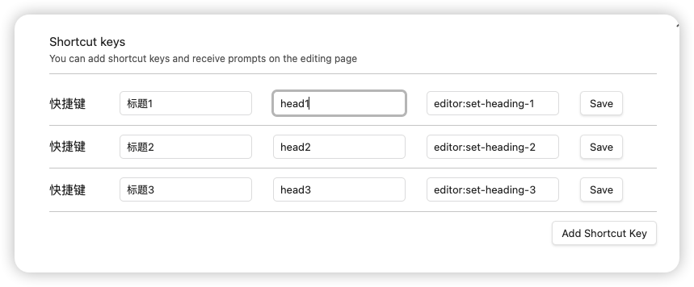

# suggest shortcut

这个插件提供了和notion相同的快捷方式，在输入 "/"的时候会提示
你可以通过配置获取大量提示语句
如果不清楚配置哪些命令，可以通过下面的操作去活命令
```
打开Obsidian的控制台 
mac option+cmd+i
win ctrl+shift+i

输入 this.app.commands
这时候可以看到有大量的命令
```
# suggest_shortcut
